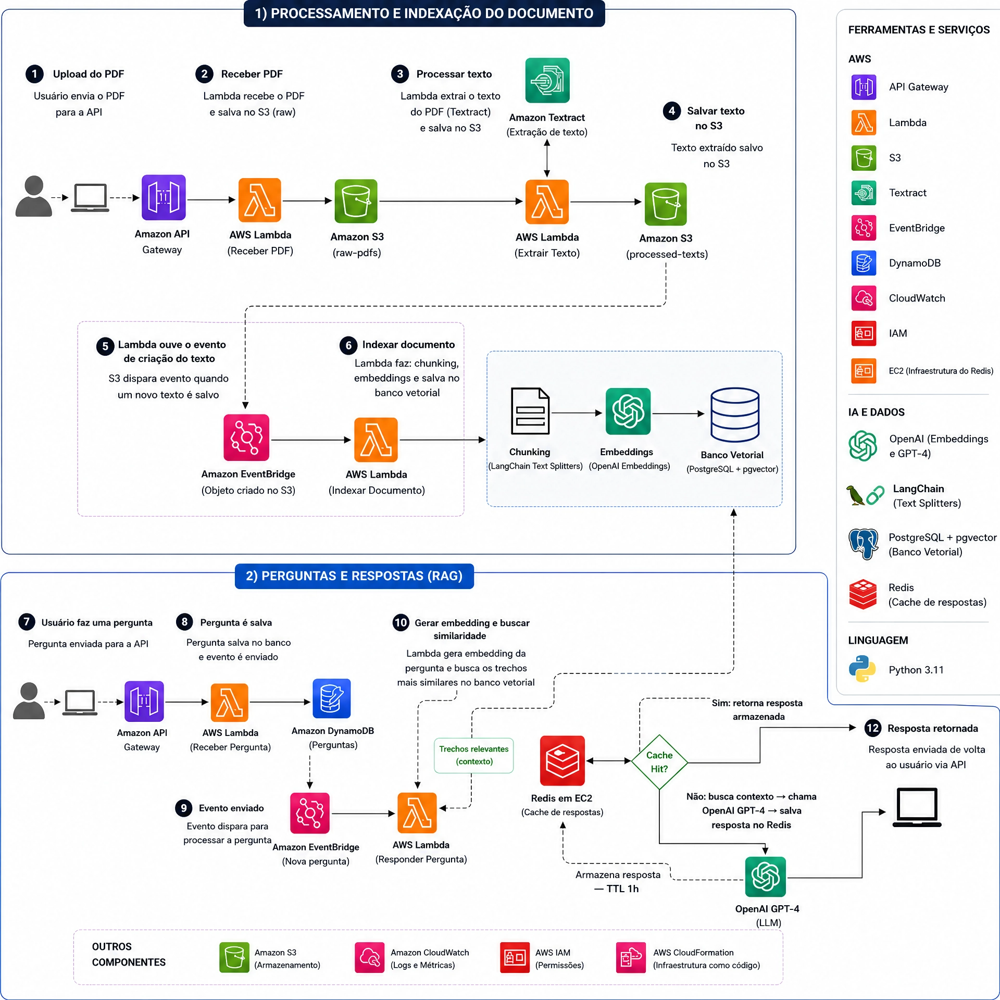
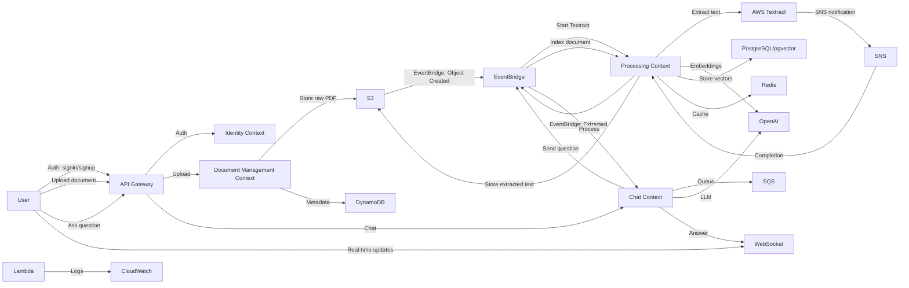

# DocInsight Architecture and Design

## 1. System Vision

### Project vision

DocInsight is an intelligent document analysis platform that enables businesses to upload, process, and query complex documents through an event-driven AWS serverless backend. It transforms PDFs into actionable insights, summarizations, entity extraction, risk signals, and retrieval-ready knowledge artifacts.

### Problem statement

Enterprises struggle to derive fast, reliable understanding from large volumes of unstructured documents such as contracts, invoices, reports, resumes, and legal filings. Manual review is slow, error-prone, and does not scale to modern regulatory and analytics demands.

### Goals

- Deliver asynchronous document ingestion and processing with strong scalability.
- Provide natural-language summaries, structured entity extraction, clause detection, and risk alerts.
- Support question-answering and retrieval-augmented generation (RAG) over processed documents.
- Maintain clear bounded contexts for maintainability and extensibility.
- Use AWS serverless primitives and event-driven architecture for reliability and operational simplicity.

### Non-goals

- Building a full document editing or collaboration suite.
- Replacing human legal or medical judgment with AI decisions.
- Implementing on-premises compute or non-AWS cloud providers.
- Providing real-time streaming analysis at ingestion latency under 1 second.

### Functional requirements

- User can upload PDF documents via API Gateway to S3.
- System persists document metadata and processing state in DynamoDB.
- Documents are processed asynchronously through event-driven workflows.
- System generates plain-language summaries for each document.
- System extracts people, organizations, dates, monetary values, clauses, and risk signals.
- System stores processed text and metadata for retrieval use.
- System supports question-answering over uploaded documents using RAG.
- System publishes domain events for processing milestones.
- System logs processing and observability events to CloudWatch.

### Non-functional requirements

- Scalability: support burst uploads and processing of thousands of documents per day.
- Resilience: recover from transient failures and process retries without data loss.
- Observability: capture metrics and logs for Lambda, EventBridge, S3, and DynamoDB.
- Security: isolate document storage, encrypt at rest, and protect API access.
- Extensibility: allow future addition of new intelligence modules and retrieval stores.
- Cost efficiency: use pay-per-use AWS Lambda, S3, DynamoDB, and EventBridge.

---

## 2. Domain Discovery

### Core Domain

- Document Intelligence
  - Primary value proposition: convert documents into summaries, structured entities, risk alerts, and retrieval-ready knowledge.

### Supporting Domains

- Document Management
  - Handles document onboarding, storage, metadata, state, and lifecycle.
- Identity
  - Manages user identity, access control, and document ownership.
- Knowledge Base
  - Manages retrieval-ready artifacts, embeddings, and Q&A interactions.

### Generic Domains

- Integration and Infrastructure
  - Event publishing, storage adapters, AI service integration, and observability.

### Entities

- Document
  - Represents an uploaded PDF or ingest artifact.
  - Attributes: document_id, owner_id, source_uri, status, upload_timestamp, processing_version.
- AnalysisResult
  - Captures output from intelligence processing.
  - Attributes: summary, entities, clauses, risk_flags, extracted_text_reference.
- KnowledgeRecord
  - Represents a RAG-ready chunk or embedding stored for retrieval.
  - Attributes: record_id, document_id, chunk_text, embedding_reference, metadata.
- UserIdentity
  - Represents an authenticated user or tenant interaction context.
  - Attributes: user_id, role, permissions.

### Value Objects

- DocumentStatus
  - Represents processing state: `uploaded`, `text_extracted`, `analysis_in_progress`, `completed`, `failed`.
- EntityType
  - Represents extracted entity categories: `person`, `organization`, `date`, `monetary_value`, `clause`, `risk`.
- ExtractionMetadata
  - Represents metadata about extraction results such as confidence, page_range, and source_text_uri.
- RiskScore
  - Represents a normalized risk rating and severity label.

### Aggregates

- DocumentAggregate
  - Root: Document
  - Includes analysis state, processing events, and references to stored intelligence results.
  - Enforces consistency for state transitions across upload, extraction, analysis, and completion.
- KnowledgeBaseAggregate
  - Root: KnowledgeRecord
  - Manages validity of retrieval items and relationships to source documents.

### Domain Services

- DocumentAnalysisService
  - Coordinates extraction, summarization, entity detection, and risk assessment.
- DocumentStorageService
  - Abstracts S3 storage operations for raw payload and processed artifacts.
- EventDispatchService
  - Publishes domain events to EventBridge and ensures contract compliance.
- EmbeddingGenerationService
  - Generates vectors for knowledge chunks using OpenAI.
- QueryResolutionService
  - Handles question-answering workflows and retrieval queries.

> Why these elements exist

- Entities model the persistent business objects around documents, intelligence outputs, and knowledge artifacts.
- Value objects encapsulate business concepts that carry no identity but provide invariants.
- Aggregates enforce transactional boundaries and prevent inconsistent document state transitions.
- Domain services coordinate business logic that spans multiple entities or infrastructure boundaries.

---

## 3. Bounded Contexts

### 1. Identity

#### Responsibilities

- Authenticate and authorize users or tenants.
- Manage document ownership and access policies.
- Provide identity context for processing events.

#### Entities

- UserIdentity
- AccessPolicy

#### Use Cases

- Authenticate API client.
- Authorize document upload and retrieval.
- Resolve ownership during event processing.

#### Events Published

- `identity.user.authenticated`
- `identity.access.granted`

#### Events Consumed

- None initially; may consume `identity.policy.updated` in future.

#### Dependencies

- No direct dependencies on other bounded contexts.
- Exposes identity metadata to API Gateway and Document Management.

### 2. Document Management

#### Responsibilities

- Accept file upload requests and store raw document assets in S3.
- Maintain document metadata and processing lifecycle state in DynamoDB.
- Trigger asynchronous processing once uploads complete.

#### Entities

- Document
- DocumentStatus
- UploadMetadata

#### Use Cases

- Register uploaded document.
- Update document state on upload completion.
- Store document metadata and version information.

#### Events Published

- `document.created`
- `document.upload.completed`
- `document.processing.started`

#### Events Consumed

- `document.analysis.completed`
- `document.processing.failed`

#### Dependencies

- Identity for owner context.
- S3 for raw document storage.
- EventBridge for publishing lifecycle events.

### 3. Document Processing

#### Responsibilities

- Extract text and metadata from PDF documents.
- Normalize document content and prepare it for AI analysis.
- Manage processing orchestration and retries.

#### Entities

- Document
- ProcessingJob
- ExtractionMetadata

#### Use Cases

- Extract text from document.
- Detect pages, structure, and raw text segments.
- Signal completion of extraction.

#### Events Published

- `document.text.extracted`
- `document.processing.failed`

#### Events Consumed

- `document.upload.completed`

#### Dependencies

- Document Management for document metadata.
- S3 for raw payload and extracted text artifacts.
- EventBridge to emit extraction completion.

### 4. Document Intelligence

#### Responsibilities

- Generate summaries, extract entities, assess risk, and create structured analysis outputs.
- Coordinate with OpenAI for natural-language understanding.
- Publish intelligence results for storage and consumption.

#### Entities

- AnalysisResult
- EntityType
- RiskScore

#### Use Cases

- Generate plain-language document summaries.
- Extract people, organizations, dates, monetary values, clauses, and risk alerts.
- Persist analysis results in DynamoDB.

#### Events Published

- `document.summary.generated`
- `document.entities.extracted`
- `document.risk.assessed`
- `document.analysis.completed`

#### Events Consumed

- `document.text.extracted`

#### Dependencies

- Document Processing for extracted text.
- OpenAI for analysis and extraction.
- EventBridge for intelligence event publication.
- DynamoDB for result persistence.

### 5. Knowledge Base

#### Responsibilities

- Create and manage retrieval-ready artifacts from analyzed documents.
- Generate embeddings and store vector references for Q&A and RAG.
- Handle question answering and retrieval operations.

#### Entities

- KnowledgeRecord
- EmbeddingMetadata
- QuestionSession

#### Use Cases

- Split document text into retrieval chunks.
- Generate embeddings and store knowledge records.
- Answer questions using retrieved content.

#### Events Published

- `document.knowledge.indexed`
- `question.asked`
- `answer.generated`

#### Events Consumed

- `document.analysis.completed`
- `document.summary.generated`

#### Dependencies

- Document Intelligence for processed text and analysis.
- OpenAI for embedding generation and answer synthesis.
- DynamoDB for knowledge indexing metadata.
- S3 for storing chunked document segments if needed.

---

## 4. AWS Infrastructure & Lambda Functions

### Functions Summary

| Function                    | Trigger                        | Purpose                              | VPC | Timeout |
| --------------------------- | ------------------------------ | ------------------------------------ | --- | ------- |
| `createDocument`            | HTTP POST /document            | Upload document metadata and payload | No  | 15s     |
| `signin`                    | HTTP POST /signin              | User authentication                  | No  | 15s     |
| `signup`                    | HTTP POST /signup              | User registration                    | No  | 15s     |
| `startExtracting`           | EventBridge (S3 raw/\*)        | Submit document to AWS Textract      | No  | 15s     |
| `indexDocument`             | EventBridge (S3 extracted/\*)  | Generate embeddings & index          | No  | 15s     |
| `textractCompleted`         | SNS (Textract callback)        | Handle Textract completion           | No  | 15s     |
| `askQuestion`               | HTTP POST /chat                | Create question & emit event         | No  | 15s     |
| `questionProcessing`        | EventBridge (QuestionAsked)    | Check cache & route question         | Yes | 15s     |
| `processQuestion`           | SQS Queue                      | LLM processing (cache miss only)     | Yes | 30s     |
| `updateCache`               | EventBridge (UpdateCache)      | Invalidate Redis cache               | Yes | 15s     |
| `getMessages`               | HTTP GET /messages/{id}        | Retrieve chat history                | No  | 15s     |
| `websocketConnect`          | WebSocket $connect             | Register connection                  | No  | 15s     |
| `websocketDisconnect`       | WebSocket $disconnect          | Unregister connection                | No  | 15s     |
| `websocketPostToConnection` | EventBridge (QuestionAnswered) | Send answer to client                | No  | 15s     |

### DynamoDB Tables

| Table                | Attributes                                           | GSI               | Purpose                              |
| -------------------- | ---------------------------------------------------- | ----------------- | ------------------------------------ |
| `document-table`     | id (PK), s3_key, textract_job_id, extracted_text_key | 3 indexes         | Document metadata & processing state |
| `user-table`         | id (PK), email                                       | email-index       | User identity & credentials          |
| `chat-table`         | id (PK), conversation_id, document_id                | 2 indexes         | Chat messages                        |
| `conversation-table` | id (PK), document_id                                 | document-id-index | Conversation sessions                |
| `connection-table`   | connection_id (PK), user_id                          | user-id-index     | WebSocket connections                |

### Storage & Messaging

| Resource                           | Purpose                           | Config                                            |
| ---------------------------------- | --------------------------------- | ------------------------------------------------- |
| S3: `docinsight-raw-documents`     | Raw PDF storage & extracted text  | EventBridge notifications enabled                 |
| SNS: `textract-document-completed` | Textract completion notifications | Lambda subscription to textractCompleted          |
| SQS: `question-queue-service`      | Question processing queue         | Visibility: 60s, DLQ: questions-queue-dlq-service |
| Redis                              | Cache for embeddings & context    | Requires VPC configuration                        |
| PostgreSQL (Neon)                  | pgvector storage for embeddings   | Requires VPC configuration                        |

---

## 5. C4 Model

### Current Project Flow



### Level 1 — Context Diagram



### Level 2 — Container Diagram

```mermaid
flowchart TB
  subgraph AWS[AWS Cloud]
    APIGW[API Gateway HTTP]
    WSAPI[API Gateway WebSocket]
    EB[EventBridge]
    S3[S3: docinsight-raw-documents]
    Textract[AWS Textract]
    SNS[SNS: textract-document-completed]
    SQS[SQS: question-queue-service]
    DDB[DynamoDB]
    CW[CloudWatch]
  end

  subgraph External
    OpenAI[OpenAI API]
    Neon[PostgreSQL/pgvector]
    Redis[Redis Cache]
  end

  subgraph Lambda[Lambda Functions - ECR Image]
    CreateDoc[createDocument]
    SignInUp[signin/signup]
    StartExt[startExtracting]
    TextractCB[textractCompleted]
    IndexDoc[indexDocument]
    AskQ[askQuestion]
    QProc[questionProcessing]
    ProcQ[processQuestion]
    UpdateCache[updateCache]
    GetMsg[getMessages]
    WSConnect[websocketConnect]
    WSDisconnect[websocketDisconnect]
    WSPost[websocketPostToConnection]
  end

  User -->|POST /document| APIGW
  APIGW -->|invoke| CreateDoc
  CreateDoc -->|Store metadata| DDB
  CreateDoc -->|Upload PDF| S3
  S3 -->|EventBridge trigger| EB

  User -->|POST /signin, /signup| APIGW
  APIGW -->|invoke| SignInUp
  SignInUp -->|Persist user| DDB

  EB -->|S3 Event: raw/*| StartExt
  StartExt -->|Call Textract| Textract
  StartExt -->|Store job_id| DDB

  Textract -->|Complete| SNS
  SNS -->|Invoke| TextractCB
  TextractCB -->|Get results| Textract
  TextractCB -->|Store text in S3| S3
  TextractCB -->|Update status| DDB

  S3 -->|EventBridge trigger| EB
  EB -->|S3 Event: extracted/*| IndexDoc
  IndexDoc -->|Call embeddings| OpenAI
  IndexDoc -->|Store vectors| Neon
  IndexDoc -->|Set cache| Redis
  IndexDoc -->|Update status| DDB

  User -->|POST /chat| APIGW
  APIGW -->|invoke| AskQ
  AskQ -->|Create message| DDB
  AskQ -->|Emit event| EB
  AskQ -->|Send to queue| SQS

  EB -->|QuestionAsked| QProc
  QProc -->|Get context| Redis
  QProc -->|Get conversation| DDB
  QProc -->|Emit UpdateCache| EB

  EB -->|UpdateCache| UpdateCache
  UpdateCache -->|Invalidate| Redis

  SQS -->|Poll| ProcQ
  ProcQ -->|Call OpenAI| OpenAI
  ProcQ -->|Store answer| DDB
  ProcQ -->|Emit event| EB

  EB -->|QuestionAnswered| WSPost
  WSPost -->|Retrieve answer| DDB
  WSPost -->|Send to client| WSAPI

  User -->|WebSocket| WSAPI
  WSAPI -->|$connect| WSConnect
  WSAPI -->|$disconnect| WSDisconnect
  WSConnect -->|Store connection| DDB
  WSDisconnect -->|Remove connection| DDB

  User -->|GET /messages/{id}| APIGW
  APIGW -->|invoke| GetMsg
  GetMsg -->|Query chat| DDB
  GetMsg -->|Return messages| APIGW

  Lambda -->|All functions| CW
```

### Communication Flow

**Document Processing Pipeline:**

1. User uploads PDF → `createDocument` stores in S3 and DynamoDB
2. S3 EventBridge trigger → `startExtracting` submits to Textract
3. Textract completes → SNS → `textractCompleted` retrieves text
4. Extracted text saved to S3 → EventBridge trigger → `indexDocument`
5. `indexDocument` generates embeddings via OpenAI, stores in pgvector, caches in Redis

**Question-Answering Pipeline:**

1. User asks question → `askQuestion` creates message record, publishes QuestionAsked event
2. EventBridge `QuestionAsked` → `questionProcessing` checks Redis for cached embeddings
   - **Cache hit**: Semantic search + LLM call → Answer sent via WebSocket (fast path ~1-2s)
   - **Cache miss**: Publish to SQS queue for deferred processing
3. SQS `processQuestion` (only if cache miss) retrieves embeddings from pgvector, calls OpenAI LLM
4. Answer generated → EventBridge `QuestionAnswered` → `websocketPostToConnection`
5. WebSocket sends real-time answer to connected client

**WebSocket Flow:**

- Client connects → `websocketConnect` stores connection_id & user_id
- Events published → EventBridge routes to `websocketPostToConnection`
- `websocketPostToConnection` looks up connections and sends via WebSocket API
- Client disconnects → `websocketDisconnect` removes connection record

---

## 6. Event Catalog

### Document Processing Events

#### QuestionAsked (docinsight.chat source)

**Emitted by:** `askQuestion`
**Consumed by:** `questionProcessing` (decides cache routing)
**EventBridge Pattern:**

```yaml
source: [docinsight.chat]
detail-type: [QuestionAsked]
```

**Payload:**

```json
{
  "question_id": "q-123",
  "conversation_id": "conv-456",
  "document_id": "doc-789",
  "user_id": "user-abc",
  "question": "What are the key terms?",
  "timestamp": "2024-01-15T10:30:00Z"
}
```

**Routing:** `questionProcessing` checks Redis cache; if miss → publishes to SQS for `processQuestion`

#### UpdateCache (docinsight.chat source)

**Emitted by:** `questionProcessing`
**Consumed by:** `updateCache`
**EventBridge Pattern:**

```yaml
source: [docinsight.chat]
detail-type: [UpdateCache]
```

**Purpose:** Signals cache invalidation for conversation context

#### QuestionAnswered (docinsight.chat source)

**Emitted by:** `processQuestion` (cache miss path) OR `questionProcessing` (cache hit path)
**Consumed by:** `websocketPostToConnection`
**EventBridge Pattern:**

```yaml
source: [docinsight.chat]
detail-type: [QuestionAnswered]
```

**Payload:**

```json
{
  "question_id": "q-123",
  "conversation_id": "conv-456",
  "answer": "The key terms are...",
  "sources": ["page_1", "page_3"],
  "timestamp": "2024-01-15T10:35:00Z"
}
```

### S3 Events (EventBridge routing)

#### Object Created: raw/\* (Document Upload)

**Trigger:** EventBridge S3 notification
**Consumed by:** `startExtracting`
**EventBridge Pattern:**

```yaml
source: [aws.s3]
detail-type: [Object Created]
detail:
  bucket:
    name: [docinsight-raw-documents]
  object:
    key:
      - wildcard: "*/raw/*"
```

**Flow:** Document uploaded → Textract submission initiated

#### Object Created: extracted/\* (Text Extraction Complete)

**Trigger:** EventBridge S3 notification
**Consumed by:** `indexDocument`
**EventBridge Pattern:**

```yaml
source: [aws.s3]
detail-type: [Object Created]
detail:
  bucket:
    name: [docinsight-raw-documents]
  object:
    key:
      - wildcard: "*/extracted/*"
```

**Flow:** Extracted text saved → Embedding generation & indexing initiated

---

## 7. EventBridge Rules & Integration

### S3 → EventBridge Notifications

S3 bucket `docinsight-raw-documents` is configured with:

```
EventBridgeConfiguration:
  EventBridgeEnabled: true
```

This automatically routes all S3 events to the default EventBridge bus, triggering:

- `startExtracting` on object creation in `*/raw/*` prefix
- `indexDocument` on object creation in `*/extracted/*` prefix

### SNS → Lambda Integration

Textract completion notifications flow through:

- AWS Textract → SNS Topic `textract-document-completed`
- SNS → Lambda `textractCompleted` (via Lambda subscription)
- Role: `textract-publish-role` allows Textract to publish to SNS

### SQS → Lambda Integration

Question processing uses FIFO semantics:

- `askQuestion` publishes message to SQS `question-queue-service`
- `processQuestion` polls queue with batch size 1
- Dead-letter queue: `questions-queue-dlq-service` (max receive count: 3)
- Visibility timeout: 60 seconds

### WebSocket → EventBridge Integration

Answer delivery to connected clients:

- EventBridge `QuestionAnswered` event → `websocketPostToConnection`
- Lambda function queries `connection-table` DynamoDB index
- Sends answer via WebSocket API Management connection

Schema:

```json
{
  "$schema": "http://json-schema.org/draft-07/schema#",
  "title": "DocumentCreated",
  "type": "object",
  "properties": {
    "document_id": { "type": "string" },
    "owner_id": { "type": "string" },
    "source_uri": { "type": "string", "format": "uri" },
    "upload_timestamp": { "type": "string", "format": "date-time" },
    "file_name": { "type": "string" },
    "content_type": { "type": "string" }
  },
  "required": [
    "document_id",
    "owner_id",
    "source_uri",
    "upload_timestamp",
    "file_name"
  ]
}
```

Example payload:

```json
{
  "document_id": "doc-12345",
  "owner_id": "user-67890",
  "source_uri": "s3://docinsight-uploads/doc-12345.pdf",
  "upload_timestamp": "2026-06-04T12:00:00Z",
  "file_name": "contract.pdf",
  "content_type": "application/pdf"
}
```

### document.upload.completed

- Source: `docinsight.document-management`
- DetailType: `document.upload.completed`

Schema:

```json
{
  "$schema": "http://json-schema.org/draft-07/schema#",
  "title": "DocumentUploadCompleted",
  "type": "object",
  "properties": {
    "document_id": { "type": "string" },
    "owner_id": { "type": "string" },
    "source_uri": { "type": "string", "format": "uri" },
    "uploaded_at": { "type": "string", "format": "date-time" },
    "document_type": { "type": "string" }
  },
  "required": ["document_id", "owner_id", "source_uri", "uploaded_at"]
}
```

Example payload:

```json
{
  "document_id": "doc-12345",
  "owner_id": "user-67890",
  "source_uri": "s3://docinsight-uploads/doc-12345.pdf",
  "uploaded_at": "2026-06-04T12:01:00Z",
  "document_type": "contract"
}
```

### document.text.extracted

- Source: `docinsight.document-processing`
- DetailType: `document.text.extracted`

Schema:

```json
{
  "$schema": "http://json-schema.org/draft-07/schema#",
  "title": "DocumentTextExtracted",
  "type": "object",
  "properties": {
    "document_id": { "type": "string" },
    "extracted_text_uri": { "type": "string", "format": "uri" },
    "page_count": { "type": "integer", "minimum": 1 },
    "extraction_completed_at": { "type": "string", "format": "date-time" }
  },
  "required": [
    "document_id",
    "extracted_text_uri",
    "page_count",
    "extraction_completed_at"
  ]
}
```

Example payload:

```json
{
  "document_id": "doc-12345",
  "extracted_text_uri": "s3://docinsight-processed/doc-12345/text.json",
  "page_count": 12,
  "extraction_completed_at": "2026-06-04T12:05:00Z"
}
```

### document.summary.generated

- Source: `docinsight.document-intelligence`
- DetailType: `document.summary.generated`

Schema:

```json
{
  "$schema": "http://json-schema.org/draft-07/schema#",
  "title": "DocumentSummaryGenerated",
  "type": "object",
  "properties": {
    "document_id": { "type": "string" },
    "summary_uri": { "type": "string", "format": "uri" },
    "summary_text": { "type": "string" },
    "generated_at": { "type": "string", "format": "date-time" }
  },
  "required": ["document_id", "summary_uri", "generated_at"]
}
```

Example payload:

```json
{
  "document_id": "doc-12345",
  "summary_uri": "s3://docinsight-processed/doc-12345/summary.json",
  "summary_text": "This contract defines payment terms and assigns liability for service deliverables.",
  "generated_at": "2026-06-04T12:10:00Z"
}
```

### document.entities.extracted

- Source: `docinsight.document-intelligence`
- DetailType: `document.entities.extracted`

Schema:

```json
{
  "$schema": "http://json-schema.org/draft-07/schema#",
  "title": "DocumentEntitiesExtracted",
  "type": "object",
  "properties": {
    "document_id": { "type": "string" },
    "entities_uri": { "type": "string", "format": "uri" },
    "entities": {
      "type": "array",
      "items": {
        "type": "object",
        "properties": {
          "type": { "type": "string" },
          "text": { "type": "string" },
          "page": { "type": "integer" },
          "confidence": { "type": "number" }
        },
        "required": ["type", "text", "page"]
      }
    },
    "generated_at": { "type": "string", "format": "date-time" }
  },
  "required": ["document_id", "entities_uri", "entities", "generated_at"]
}
```

Example payload:

```json
{
  "document_id": "doc-12345",
  "entities_uri": "s3://docinsight-processed/doc-12345/entities.json",
  "entities": [
    { "type": "person", "text": "John Doe", "page": 2, "confidence": 0.96 },
    {
      "type": "organization",
      "text": "Acme Corp",
      "page": 1,
      "confidence": 0.94
    },
    {
      "type": "monetary_value",
      "text": "$120,000",
      "page": 4,
      "confidence": 0.9
    }
  ],
  "generated_at": "2026-06-04T12:12:00Z"
}
```

### document.risk.assessed

- Source: `docinsight.document-intelligence`
- DetailType: `document.risk.assessed`

Schema:

```json
{
  "$schema": "http://json-schema.org/draft-07/schema#",
  "title": "DocumentRiskAssessed",
  "type": "object",
  "properties": {
    "document_id": { "type": "string" },
    "risk_level": { "type": "string", "enum": ["low", "medium", "high"] },
    "risk_reasons": {
      "type": "array",
      "items": { "type": "string" }
    },
    "details_uri": { "type": "string", "format": "uri" },
    "assessed_at": { "type": "string", "format": "date-time" }
  },
  "required": ["document_id", "risk_level", "details_uri", "assessed_at"]
}
```

Example payload:

```json
{
  "document_id": "doc-12345",
  "risk_level": "medium",
  "risk_reasons": [
    "Ambiguous indemnity clause",
    "Late payment penalty not defined"
  ],
  "details_uri": "s3://docinsight-processed/doc-12345/risk.json",
  "assessed_at": "2026-06-04T12:14:00Z"
}
```

### document.analysis.completed

- Source: `docinsight.document-intelligence`
- DetailType: `document.analysis.completed`

Schema:

```json
{
  "$schema": "http://json-schema.org/draft-07/schema#",
  "title": "DocumentAnalysisCompleted",
  "type": "object",
  "properties": {
    "document_id": { "type": "string" },
    "summary_uri": { "type": "string", "format": "uri" },
    "entities_uri": { "type": "string", "format": "uri" },
    "risk_uri": { "type": "string", "format": "uri" },
    "completed_at": { "type": "string", "format": "date-time" }
  },
  "required": ["document_id", "completed_at"]
}
```

Example payload:

```json
{
  "document_id": "doc-12345",
  "summary_uri": "s3://docinsight-processed/doc-12345/summary.json",
  "entities_uri": "s3://docinsight-processed/doc-12345/entities.json",
  "risk_uri": "s3://docinsight-processed/doc-12345/risk.json",
  "completed_at": "2026-06-04T12:15:00Z"
}
```

### document.knowledge.indexed

- Source: `docinsight.knowledge-base`
- DetailType: `document.knowledge.indexed`

Schema:

```json
{
  "$schema": "http://json-schema.org/draft-07/schema#",
  "title": "DocumentKnowledgeIndexed",
  "type": "object",
  "properties": {
    "document_id": { "type": "string" },
    "knowledge_count": { "type": "integer", "minimum": 0 },
    "indexed_at": { "type": "string", "format": "date-time" }
  },
  "required": ["document_id", "knowledge_count", "indexed_at"]
}
```

Example payload:

```json
{
  "document_id": "doc-12345",
  "knowledge_count": 18,
  "indexed_at": "2026-06-04T12:18:00Z"
}
```

### question.asked

- Source: `docinsight.knowledge-base`
- DetailType: `question.asked`

Schema:

```json
{
  "$schema": "http://json-schema.org/draft-07/schema#",
  "title": "QuestionAsked",
  "type": "object",
  "properties": {
    "question_id": { "type": "string" },
    "document_id": { "type": "string" },
    "user_id": { "type": "string" },
    "query_text": { "type": "string" },
    "asked_at": { "type": "string", "format": "date-time" }
  },
  "required": [
    "question_id",
    "document_id",
    "user_id",
    "query_text",
    "asked_at"
  ]
}
```

Example payload:

```json
{
  "question_id": "q-001",
  "document_id": "doc-12345",
  "user_id": "user-67890",
  "query_text": "What are the payment terms?",
  "asked_at": "2026-06-04T12:20:00Z"
}
```

### answer.generated

- Source: `docinsight.knowledge-base`
- DetailType: `answer.generated`

Schema:

```json
{
  "$schema": "http://json-schema.org/draft-07/schema#",
  "title": "AnswerGenerated",
  "type": "object",
  "properties": {
    "question_id": { "type": "string" },
    "document_id": { "type": "string" },
    "user_id": { "type": "string" },
    "answer_text": { "type": "string" },
    "source_references": {
      "type": "array",
      "items": { "type": "string" }
    },
    "generated_at": { "type": "string", "format": "date-time" }
  },
  "required": [
    "question_id",
    "document_id",
    "user_id",
    "answer_text",
    "generated_at"
  ]
}
```

Example payload:

```json
{
  "question_id": "q-001",
  "document_id": "doc-12345",
  "user_id": "user-67890",
  "answer_text": "The contract requires payment within 30 days of invoice receipt.",
  "source_references": ["page 3 clause 2.1"],
  "generated_at": "2026-06-04T12:20:30Z"
}
```

---

## 7. Clean Architecture Design

### Identity Context

- Domain Layer: `UserIdentity`, `AccessPolicy`, authentication invariants.
- Application Layer: authentication and authorization use cases, policy evaluation services.
- Infrastructure Layer: token validation, API Gateway authorizer integration, identity provider clients.
- Presentation Layer: API Gateway authorizer and security middleware.

### Document Management Context

- Domain Layer: `Document`, `DocumentStatus`, lifecycle rules, aggregate invariants.
- Application Layer: upload registration, metadata persistence, state transition orchestrators.
- Infrastructure Layer: S3 persistence adapter, DynamoDB repository adapter, EventBridge publisher adapter.
- Presentation Layer: REST API endpoints for upload initiation and status queries.

### Document Processing Context

- Domain Layer: `ProcessingJob`, `ExtractionMetadata`, text extraction invariants.
- Application Layer: extraction workflow, retry handling, text artifact creation.
- Infrastructure Layer: PDF/OCR adapters, S3 storage adapters, EventBridge integration.
- Presentation Layer: event-triggered Lambda handlers and monitoring dashboards.

### Document Intelligence Context

- Domain Layer: `AnalysisResult`, `EntityType`, `RiskScore`, analysis business rules.
- Application Layer: intelligence workflow, summary generation, entity extraction orchestration.
- Infrastructure Layer: OpenAI client adapter, DynamoDB result repository, EventBridge publisher.
- Presentation Layer: event-driven function and analytics endpoints.

### Knowledge Base Context

- Domain Layer: `KnowledgeRecord`, `EmbeddingMetadata`, retrieval invariants.
- Application Layer: chunking, embedding generation, question-answer orchestration.
- Infrastructure Layer: OpenAI embedding adapter, DynamoDB vector/index metadata store, S3 chunk storage.
- Presentation Layer: query API endpoints and event-handling Lambda functions.

### Dependency direction

- Higher layers depend only on abstractions defined in lower or same layers.
- Domain layer has no dependencies on application or infrastructure.
- Application layer depends on domain abstractions and ports.
- Infrastructure layer implements ports and depends on external AWS/OpenAI services.
- Presentation layer composes application services and triggers workflows.

---

## 8. Ports and Adapters

### DocumentRepository

- Purpose: persist and retrieve document aggregates and metadata.
- Methods:
  - `get_document(document_id)`
  - `save_document(document)`
  - `update_document_status(document_id, status, metadata)`
- Inputs: document identifier, document entity, status updates.
- Outputs: document entity, operation result.

### StorageService

- Purpose: abstract raw and processed object storage in S3.
- Methods:
  - `upload_object(bucket, key, body, metadata)`
  - `get_object(bucket, key)`
  - `generate_presigned_url(bucket, key, expires_in)`
- Inputs: bucket, key, payload, metadata.
- Outputs: storage URI, object stream, signed URL.

### AIService

- Purpose: execute OpenAI calls for summarization, entity extraction, risk analysis, and answers.
- Methods:
  - `generate_summary(prompt, context)`
  - `extract_entities(prompt, text)`
  - `assess_risk(prompt, text)`
  - `answer_question(prompt, context)`
- Inputs: prompt text, document context, parameters.
- Outputs: AI response payload, structured results.

### EventPublisher

- Purpose: publish domain events to EventBridge.
- Methods:
  - `publish_event(source, detail_type, detail)`
- Inputs: source string, detail type, event detail object.
- Outputs: publish acknowledgement.

### EmbeddingService

- Purpose: generate vector embeddings for text chunks.
- Methods:
  - `create_embedding(text, model)`
- Inputs: text string, model identifier.
- Outputs: embedding vector array.

### VectorStore

- Purpose: store and look up retrieval-ready knowledge metadata.
- Methods:
  - `save_record(knowledge_record)`
  - `query_similar(embedding, top_k)`
- Inputs: knowledge record, embedding vector, query size.
- Outputs: saved record confirmation, ranked knowledge records.

### DocumentProcessingService

- Purpose: coordinate PDF extraction and text normalization.
- Methods:
  - `extract_text(document_id, source_uri)`
- Inputs: document identifier, raw object URI.
- Outputs: extracted text artifacts and metadata.

### QuestionAnsweringService

- Purpose: orchestrate retrieval and answer generation for user queries.
- Methods:
  - `ask_question(document_id, user_id, query)`
- Inputs: document identifier, user identifier, query text.
- Outputs: answer text, source references.

> Note: these ports define the interfaces needed before any implementation is written.

---

## 9. Project Structure

### Recommended folder structure

```
/.
  README.md
  pyproject.toml
  serverless.yml
  docker-compose.yml
  .env.example

  /docs
    architecture.md
    event-storming.md
    /adr
      001-clean-architecture.md
      002-eventbridge.md
      003-dynamodb.md
      ...

  /src
    /shared
      /domain
        event.py
        aggregate.py
        value_object.py
      /application
        /ports
          storage_port.py
          ai_port.py
          event_bus_port.py
      /infrastructure
        /eventbridge
        /dynamodb
        /s3
      /config
        settings.py

    /upload
      /domain
        /entities
          document.py
        /events
          document_uploaded.py
      /application
        /use_cases
          create_upload.py
        /dto
      /infrastructure
        /repositories
        /handlers
          create_upload_handler.py
      /contracts
        events.py

    /extraction
      /domain
      /application
      /infrastructure
      /contracts

    /analysis
      /domain
      /application
      /infrastructure
      /contracts

    /qa
      /domain
      /application
      /infrastructure
      /contracts

  /tests
    /unit
    /integration
    /contract

  /scripts
    deploy.sh
    localstack-bootstrap.sh
```

    /fixtures

README.md
serverless.yml

```

### Serverless Framework configuration

- Central service root in `serverless.yml`.
- Per-function Lambda definitions under `functions:`.
- Resource declarations for DynamoDB tables, S3 buckets, EventBridge event bus, and IAM roles.
- Environment variables managed with `serverless` variables and `env.example`.
- Use separate stages for `dev`, `staging`, `prod`.

### Docker setup

- `docker-compose.yml` for LocalStack and supporting infrastructure.
- Use Docker for local AWS service emulation and consistent dependency management.
- Keep container images aligned with LocalStack supported versions.

### LocalStack setup

- `localstack.yml` or `docker-compose.yml` service definitions.
- Bootstrap script to create S3 buckets, DynamoDB tables, EventBridge bus, and IAM-like resources.
- Local environment overrides to point service clients to LocalStack endpoints.

### Environment configuration strategy

- `env.example` defines required variables: `AWS_REGION`, `OPENAI_API_KEY`, `STAGE`, `EVENT_BUS_NAME`, `S3_BUCKET_UPLOADS`, `S3_BUCKET_PROCESSED`, `DDB_DOCUMENT_TABLE`, `DDB_KNOWLEDGE_TABLE`.
- Use `serverless-dotenv-plugin` or built-in `serverless` support for environment injection.
- Keep secrets outside source control and use parameter store / secrets manager in production.

---

## 10. ADRs

The architecture decision records for DocInsight are stored separately under `docs/adr/`.

### Core Infrastructure & Platform
- [ADR 001 — AWS Lambda](adr/001-aws-lambda.md) — Serverless compute runtime
- [ADR 006 — Serverless Framework](adr/006-serverless-framework.md) — Infrastructure as Code
- [ADR 007 — Docker](adr/007-docker.md) — Container images for Lambda
- [ADR 008 — LocalStack](adr/008-localstack.md) — Local AWS emulation

### Storage & Data
- [ADR 003 — DynamoDB](adr/003-dynamodb.md) — Document metadata and state
- [ADR 004 — S3](adr/004-s3.md) — Raw document and artifact storage
- [ADR 014 — PostgreSQL with pgvector](adr/014-postgresql-pgvector.md) — Vector embeddings storage

### API & Real-time Communication
- [ADR 013 — API Gateway](adr/013-api-gateway.md) — HTTP and WebSocket APIs
- [ADR 016 — JWT Authentication](adr/016-jwt-authentication.md) — Stateless token-based auth

### Event-Driven Orchestration & Messaging
- [ADR 002 — EventBridge](adr/002-eventbridge.md) — Event routing and orchestration
- [ADR 012 — SNS & SQS](adr/012-sns-sqs.md) — Asynchronous messaging (Textract notifications, question queue)

### AI & Document Processing
- [ADR 005 — OpenAI](adr/005-openai.md) — LLM and embeddings
- [ADR 011 — AWS Textract](adr/011-aws-textract.md) — Document text extraction

### Performance & Caching
- [ADR 015 — Redis](adr/015-redis-caching.md) — In-memory caching layer

### Architecture & Design Patterns
- [ADR 009 — Clean Architecture](adr/009-clean-architecture.md) — Layered separation of concerns
- [ADR 010 — Event-Driven Architecture](adr/010-event-driven-architecture.md) — Asynchronous event-driven design
```
